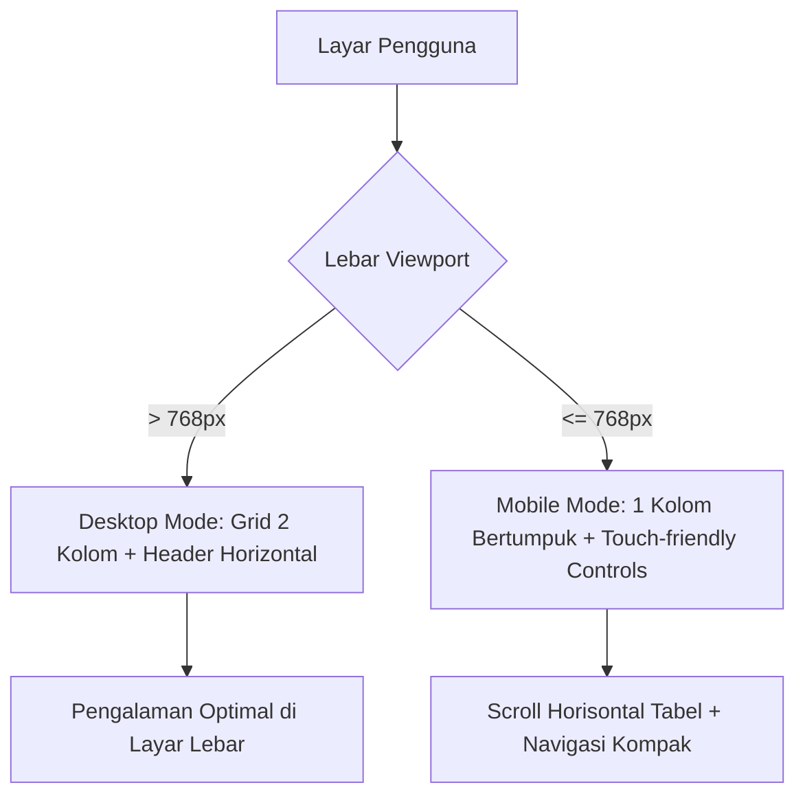

# 🌟 Portofolio Profil Web - Michael Pratama Nasution

<p align="center">
  
</p>

<p align="center">
  <a href="https://github.com/MichaelNasution"></a>
  
  
  
</p>

<p align="center">
  
  
  
  
  
</p>

---

## 📌 Ringkasan Proyek

Repository ini berisi implementasi halaman web profil profesional yang dibangun menggunakan **HTML5 Semantik murni** dan **CSS3 modern (Pure Vanilla CSS)** tanpa pustaka atau framework pihak ketiga. Halaman web ini dirancang untuk memenuhi kriteria penugasan **Praktikum Pemrograman dan Pengujian Aplikasi Web (PPW - 12S3101) Minggu 02**.

Fokus utama perancangan meliputi:
- **Semantika HTML5 Standar W3C**: Pemanfaatan tag `<header>`, `<nav>`, `<main>`, `<section>`, `<article>`, `<aside>`, `<footer>`, `<figure>`, `<table>`, serta pengelompokan formulir menggunakan `<fieldset>` dan `<legend>`.
- **Desain Visual & Tema "Rustic Charm"**: Penerapan aturan komposisi warna internasional **60-30-10** yang harmonis, hangat, dan ramah di mata.
- **Aksesibilitas (WCAG 2.2 Level AA)**: Rasio kontras teks tinggi (>10:1), navigasi keyboard penuh (`:focus-visible`), penanda label eksplisit, dan dukungan `prefers-reduced-motion`.
- **Tata Letak Adaptif & Responsif**: Mengombinasikan **CSS Flexbox** dan **CSS Grid** untuk transisi antarmuka mulus di layar Desktop, Tablet, hingga Layar Ponsel Pintar (*Mobile*).

---

## 🧭 Daftar Isi Cepat

- [✨ Fitur Utama Halaman](#-fitur-utama-halaman)
- [🎨 Sistem Desain & Palet Warna "Rustic Charm"](#-sistem-desain--palet-warna-rustic-charm)
- [🏛️ Anatomi & Struktur Dokumen](#️-anatomi--struktur-dokumen)
- [📱 Pengujian Responsivitas & Aksesibilitas](#-pengujian-responsivitas--aksesibilitas)
- [📂 Struktur Berkas Proyek](#-struktur-berkas-proyek)
- [🚀 Cara Menjalankan Halaman Web](#-cara-menjalankan-halaman-web)
- [✅ Checklist Capaian Tugas](#-checklist-capaian-tugas)
- [👤 Biodata Mahasiswa](#-biodata-mahasiswa)

---

## ✨ Fitur Utama Halaman

```
┌───────────────────────────────────────────────────────────┐
│ [Header Sticky] Brand Name + Navigasi Fleksibel           │
├───────────────────────────────────────────────────────────┤
│ [Section 1: Tentang Saya]                                 │
│  ├─ Banner Aksen + Avatar Inisial Bulat ("MP")            │
│  ├─ Kolom Kiri: Biografi Pengembang + Badge Pills         │
│  └─ Kolom Kanan: Rincian Kartu Identitas Vertikal         │
├───────────────────────────────────────────────────────────┤
│ [Section 2: Portofolio Karya]                             │
│  ├─ Tabel Rekapitulasi Proyek (thead, tbody, tfoot)       │
│  └─ CSS Grid: Detail Sorotan Proyek (ul) & Keahlian (ol)  │
├───────────────────────────────────────────────────────────┤
│ [Section 3: Formulir Layanan Interaktif]                  │
│  ├─ Fieldset 1: Data Diri (Nama, Email, Telp)             │
│  ├─ Fieldset 2: Kebutuhan (Kategori, Radio, Pesan, Check) │
│  └─ Tombol CTA "Kirim Permintaan Konsultasi"             │
├───────────────────────────────────────────────────────────┤
│ [Aside] Fakta Menarik & Fokus Riset                       │
├───────────────────────────────────────────────────────────┤
│ [Footer] Hak Cipta, Afiliasi Kampus & Tautan Cepat        │
└───────────────────────────────────────────────────────────┘
```

---

## 🎨 Sistem Desain & Palet Warna "Rustic Charm"

Halaman web ini mengadopsi palet warna **Rustic Charm** dengan aturan proporsi visual **60-30-10** untuk menjamin kenyamanan membaca serta hierarki elemen yang tegas:

| Proporsi | Peran Desain | Nama Warna | Kode HEX | Nilai RGB | Preview |
| :---: | :--- | :--- | :---: | :---: | :---: |
| **60%** | **Dominan (Background & Permukaan)** | Floral White | `#FFFCF2` | `rgb(255, 252, 242)` |  |
| **30%** | **Struktur, Teks & Kontur** | Charcoal Brown | `#403D39` | `rgb(64, 61, 57)` |  |
| **30%** | **Heading & Dark Accent** | Carbon Black | `#252422` | `rgb(37, 36, 34)` |  |
| **30%** | **Border & Separator** | Silver Mist | `#CCC5B9` | `rgb(204, 197, 185)` |  |
| **10%** | **Aksen Interaktif (CTA & Highlight)** | Spicy Paprika | `#EB5E28` | `rgb(235, 94, 40)` |  |

<details>
<summary>🔍 <b>Klik untuk melihat Variabel CSS (CSS Custom Properties)</b></summary>

```css
:root {
  /* 60% - Warna Dominan Netral */
  --color-bg: #FFFCF2;               /* Floral White: latar utama halaman */
  --color-surface: #FFFCF2;          /* Floral White: permukaan card & section */
  --color-surface-subtle: #F5EFE6;   /* Tint hangat untuk card bertingkat */
  --color-surface-alt: #EFE8DC;      /* Background selang-seling tabel */

  /* 30% - Warna Teks & Elemen Struktural */
  --color-text-main: #403D39;        /* Charcoal Brown: teks body (kontras > 10:1) */
  --color-text-muted: #6B665F;       /* Charcoal Brown muda: teks pendukung */
  --color-heading: #252422;          /* Carbon Black: heading h1-h3 (kontras > 15:1) */
  --color-border: #CCC5B9;           /* Silver: garis border pemisah */
  --color-dark-surface: #252422;     /* Carbon Black: latar belakang footer */

  /* 10% - Warna Aksen Interaktif */
  --color-accent: #EB5E28;           /* Spicy Paprika: tombol CTA & indikator aktif */
  --color-accent-hover: #D14D19;     /* Spicy Paprika gelap saat hover */
  --color-accent-subtle: rgba(235, 94, 40, 0.12); /* Pill badge background */
  --color-accent-focus: rgba(235, 94, 40, 0.25);  /* Focus outline ring */
}
```
</details>

---

## 🏛️ Anatomi & Struktur Dokumen

Setiap blok kode disusun dengan rapi, beranotasi lengkap, dan mematuhi kaidah semantik HTML5 terkini.

<details open>
<summary>🧭 <b>1. Header & Navigasi Utama (Sticky)</b></summary>
<br>

- Menggunakan tag `<header>` dengan properti `position: sticky; top: 0;` sehingga menu navigasi tetap dapat diakses saat pengguna menggulir halaman (*scrolling*).
- Menampilkan nama lengkap serta identitas institusi kampus, dipadukan dengan tautan jangkar internal (`#tentang`, `#portofolio`, `#kontak`) dengan transisi warna saat kursor diarahkan (*hover*).
</details>

<details>
<summary>👤 <b>2. Section Profil Profesional (#tentang)</b></summary>
<br>

- **Banner & Avatar**: Menggunakan banner solid Spicy Paprika dengan avatar inisial bulat (`MP`) bertingkat (*floating initial badge*) dengan bayangan halus.
- **Layout 2 Kolom**: Dibangun dengan **CSS Grid** (`grid-template-columns: 1.65fr 1fr;`):
  - **Kolom Kiri**: Biografi pengembang yang komprehensif, dilengkapi *skill pill badges* interaktif beranimasi halus saat di-hover.
  - **Kolom Kanan**: Kartu identitas vertikal memuat NIM, Institusi, Program Studi, Lokasi, dan tautan surat elektronik langsung (`mailto:`).
</details>

<details>
<summary>💼 <b>3. Section Portofolio Karya (#portofolio)</b></summary>
<br>

- **Tabel Rekapitulasi Semantik**:
  - Memanfaatkan elemen `<caption>`, `<thead>`, `<tbody>`, dan `<tfoot>`.
  - Menggunakan atribut `scope="col"` pada kolom header dan `scope="row"` pada baris item untuk aksesibilitas pembaca layar (*screen reader*).
  - Dilengkapi *zebra-striping* selang-seling serta pembungkus `.table-responsive` agar tabel dapat digeser horizontal secara halus di perangkat ponsel tanpa merusak tata letak layar.
- **Kartu Sorotan Proyek & Galeri Keahlian**:
  - Menggunakan **CSS Grid** responsif (`repeat(auto-fit, minmax(320px, 1fr))`).
  - Menampilkan daftar fitur proyek utama dalam bentuk daftar tak berurut (`<ul>`) dan hierarki kompetensi dalam daftar berurut (`<ol>`).
</details>

<details>
<summary>📝 <b>4. Section Formulir Interaktif & Aksesibel (#kontak)</b></summary>
<br>

- Mengelompokkan formulir secara logis dengan dua pasang `<fieldset>` dan `<legend>`:
  1. **Data Identitas Diri**: Input teks nama, email validasi HTML5, dan nomor telepon.
  2. **Detail Permintaan & Pesan**: Pilihan kategori `<select>`, estimasi pekan `<input type="number">`, pilihan radio bertema jenis kebutuhan, deskripsi pesan `<textarea>`, dan persetujuan `<input type="checkbox">`.
- Semua kolom input terhubung secara eksplisit dengan `<label for="...">`.
- Kolom wajib ditandai dengan indikator `<span class="req">*</span>` dan atribut `required`.
- Desain *Focus Ring* kontras tinggi (`--color-accent-focus`) saat input sedang aktif digunakan keyboard (*Tab key*).
</details>

<details>
<summary>💡 <b>5. Aside & Footer Dokumen</b></summary>
<br>

- **`<aside>`**: Menyajikan informasi sampingan yang melengkapi konten utama, seperti catatan prestasi partisipasi seleksi GEMASTIK dan fokus riset web.
- **`<footer>`**: Diberi kontras warna gelap (`--color-dark-surface`) dengan radius bagian atas, memuat informasi hak cipta akademik, tahun perkuliahan, tombol navigasi kembali ke atas (`#tentang`), serta tautan eksternal aman (`rel="noopener noreferrer"`).
</details>

---

## 📱 Pengujian Responsivitas & Aksesibilitas

### 📐 Breakpoint Responsif Media Query
Antarmuka web telah diuji dan dioptimalkan untuk berbagai resolusi layar:

| Ukuran Layar | Target Perangkat | Penyesuaian Tata Letak |
| :--- | :--- | :--- |
| **> 768px** | Komputer & Laptop | Layout 2 Kolom Profil, Tabel Lebar Penuh, Grid Portofolio Multi-kolom |
| **≤ 768px** | Tablet & Smartphone | Header bertumpuk vertikal, Profil berubah 1 kolom, Tabel dengan touch scroll, formulir adaptif penuh |



### ♿ Standar Aksesibilitas Web (WCAG 2.2 Level AA)
- [x] **Rasio Kontras**: Teks Charcoal Brown (`#403D39`) pada Floral White (`#FFFCF2`) mencapai rasio kontras **10.5:1** (jauh melampaui batas minimum WCAG AA yaitu 4.5:1).
- [x] **Akses Keyboard**: Seluruh elemen interaktif (`a`, `button`, `input`, `select`, `textarea`) memiliki outline visual tegas saat dinavigasi via tombol `Tab`.
- [x] **Dukungan Reduced Motion**: Dilengkapi aturan `@media (prefers-reduced-motion: reduce)` yang secara otomatis mematikan atau meminimalkan durasi animasi bagi pengguna yang memiliki gangguan vestibular.
- [x] **Atribut ARIA**: Dilengkapi dengan `aria-label` pada elemen navigasi, section penting, dan `aria-describedby` untuk panduan input email.

---

## 📂 Struktur Berkas Proyek

```plaintext
ppw-2026-week2-12S24003/
├── index.html        # Dokumen utama HTML5 berstruktur semantik lengkap
├── style.css         # Berkas tata gaya CSS3 murni (Rustic Charm Design System)
└── README.md         # Dokumentasi interaktif dan penjelasan komprehensif proyek
```

---

## 🚀 Cara Menjalankan Halaman Web

Anda dapat menjalankan halaman web ini dengan salah satu dari metode berikut:

### Opsi 1: Menggunakan VS Code Live Server (Direkomendasikan)
1. Buka folder repositori ini di **Visual Studio Code**.
2. Pastikan ekstensi **Live Server** (oleh *Ritwick Dey*) telah terpasang.
3. Klik kanan pada berkas `index.html` dan pilih **Open with Live Server**, atau klik tombol **Go Live** di *status bar* bawah VS Code.
4. Halaman akan terbuka otomatis di peramban pada alamat `http://127.0.0.1:5500/index.html`.

### Opsi 2: Buka Langsung di Peramban Web (Direct File Access)
1. Buka File Explorer di komputer Anda.
2. Masuk ke direktori proyek:
   ```plaintext
   d:\[college]\PPW\ppw-2026-week2-12S24003\
   ```
3. Klik dua kali pada berkas `index.html` (atau klik kanan $\rightarrow$ **Open with** $\rightarrow$ pilih browser favorit Anda: Google Chrome, Microsoft Edge, Mozilla Firefox).

### Opsi 3: Menggunakan Server Lokal Python / Node.js
Jika Anda memiliki terminal aktif di folder proyek:

```bash
# Menggunakan Python 3
python -m http.server 8000

# ATAU menggunakan npx (Node.js)
npx serve .
```
Lalu buka alamat `http://localhost:8000` pada peramban web Anda.

---

## ✅ Checklist Capaian Tugas

Berdasarkan capaian praktikum minggu ke-2, seluruh instrumen telah diselesaikan secara menyeluruh:

- [x] **Struktur HTML5 Semantik**: `<header>`, `<nav>`, `<main>`, `<section>`, `<article>`, `<aside>`, `<footer>`.
- [x] **Penggunaan Heading Logis**: Hierarki judul yang konsisten dari `<h1>` hingga `<h3>`.
- [x] **Daftar Berurutan & Tak Berurutan**: Menggunakan tag `<ul>` dan `<ol>` dengan styling teratur.
- [x] **Tabel Data Semantik**: Memiliki `<caption>`, `<thead>`, `<tbody>`, `<tfoot>`, `<th>` bertingkat, dan pembungkus responsif.
- [x] **Formulir Interaktif Lengkap**: Memiliki `<fieldset>`, `<legend>`, `<label>`, `<input>` (text, email, tel, number, radio, checkbox), `<select>`, `<textarea>`, dan tombol `<button type="submit">`.
- [x] **Sistem Desain Warna Harmonis**: Penerapan aturan 60-30-10 dengan palet **Rustic Charm**.
- [x] **Tata Letak Modern**: Menggabungkan CSS Flexbox dan CSS Grid.
- [x] **Desain Responsif**: Penataan antarmuka adaptif pada breakpoint layar mobile (768px).
- [x] **Standar Aksesibilitas**: Memenuhi WCAG 2.2 AA untuk kontras warna, keyboard navigation, dan reduced motion.

---

## 👤 Biodata Mahasiswa

<div align="center">
  <table>
    <tr>
      <td align="center">
        
      </td>
      <td>
        <strong>Nama Lengkap:</strong> Michael Pratama Nasution<br>
        <strong>NIM:</strong> 12S24003<br>
        <strong>Program Studi:</strong> S1 Sistem Informasi<br>
        <strong>Fakultas:</strong> Fakultas Informatika &amp; Teknik Elektro (FITE)<br>
        <strong>Institusi:</strong> Institut Teknologi Del, Sitoluama, Laguboti, Toba<br>
        <strong>Mata Kuliah:</strong> Pemrograman dan Pengujian Aplikasi Web (12S3101)<br>
        <strong>Tahun Akademik:</strong> 2025/2026
      </td>
    </tr>
  </table>
</div>

<p align="center">
  Dibuat dengan dedikasi untuk keunggulan akademik dan standar industri rekayasa perangkat lunak web modern.<br>
  &copy; 2026 Michael Pratama Nasution. All rights reserved.
</p>
